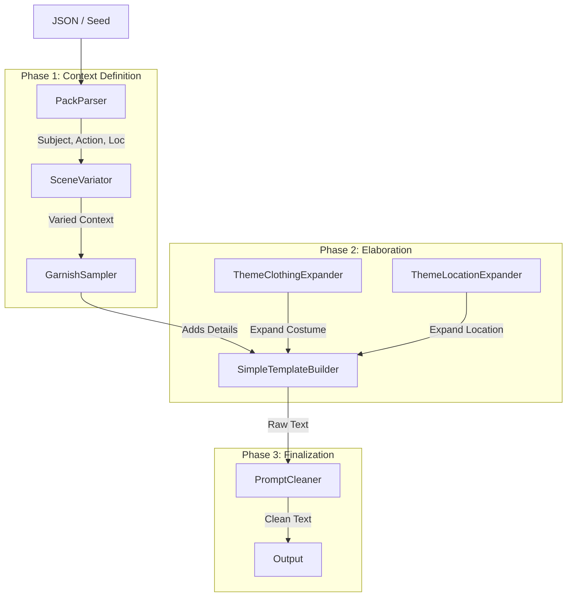

# Architecture & Data Flow

PromptBuilder は、ComfyUI 用の **構造化プロンプト生成システム** です。
シード値 (Seed) と設定に基づき、決定論的 (Deterministic) かつ多様性のあるプロンプトを出力します。

## 概要

従来のランダムテキスト生成と異なり、以下の特徴を持ちます：
1. **意図 (Intent) と具象 (Concrete) の分離**: 「戦闘準備」という意図から「剣を持つ」「構える」といった具体的アクションを導出します。
2. **構造化データ (Context)**: ノード間で JSON やオブジェクト (`PromptContext`) を受け渡し、一貫性を保ちます。
3. **拡張性 (Plugins)**: 新しい語彙やルールを `vocab/` ディレクトリに追加するだけで拡張可能です。
4. **検証可能性 (Verification)**: 全ての生成ロジックは単体テスト・結合テストで検証可能です。

---

## Directory Structure

```text
root/
├── core/                   # 共通データ構造 (Schema)
│   └── schema.py           # PromptContext, MetaInfo 定義
├── vocab/                  # 語彙・ロジック定義 (Vocabulary & Logic)
│   ├── background/         # 場所・背景定義 (LOC_TAG_MAP, CONCEPT_PACKS)
│   ├── clothing/           # 衣装定義 (THEME_TO_PACKS, CONCEPT_PACKS)
│   ├── garnish/            # 装飾・ポーズ・表情 (Action/Object Roulette)
│   └── ...
├── assets/                 # 検証スクリプト・テストデータ
│   ├── fixtures/           # テスト用入力データ (benchmark_inputs.jsonl)
│   ├── results/            # ベースライン生成結果・レポート
│   ├── test_*.py           # 単体テスト (Unit Tests)
│   ├── verify_*.py         # 整合性チェック (Integrity Checks)
│   ├── evaluate_kpi.py     # KPI (多様性・エラー率) 評価
│   └── generate_baseline.py # ベースライン生成スクリプト
├── nodes_*.py              # ComfyUI カスタムノード実装 (Entry Points)
├── prompt_builder_workflow.json # 推奨ワークフロー
├── prompts.jsonl           # パック定義 (Intent Definitions)
└── mood_map.json           # ムード・スタイル定義
```

---

## Core Components (Nodes)

### 1. `nodes_pack_parser.py` (PackParser)
- **役割**: 入力 JSON (またはランダム選択) を解析し、基本コンテキスト (`subj`, `costume`, `loc`, `action`, `mood`) を決定します。
- **入力**: JSON String, Seed
- **出力**: 分解された各要素 (Subject, Costume Key, Location Tag, Action Raw, etc.)

### 2. `nodes_scene_variator.py` (SceneVariator)
- **役割**: 基本コンテキストに対し、シーンのバリエーション（時間帯、天候、微細な状況変化）を付与します。
- **機能**: `variation_mode` 設定により、元の意図を保ちつつ表現を多様化します。

### 3. `nodes_garnish.py` (GarnishSampler)
- **役割**: アクションや状況に「付け合わせ (Garnish)」を追加します。
- **内容**: 表情 (Expression)、視線 (Gaze)、エフェクト (Effects)、サブオブジェクト (Small items)。
- **ロジック**: `improved_pose_emotion_vocab.py` (現 `vocab/garnish/`) のロジックを使用。

### 4. `nodes_simple_template.py` (SimpleTemplateBuilder)
- **役割**: 決定された全要素を自然言語の文章 (Template) に組み込みます。
- **入力**: 各要素 (`subj`, `action`, `garnish`, `loc` 等)
- **出力**: 完成したプロンプト文字列 (Raw Prompt)
- **機能**: `composition_mode` により、イントロ・ボディ・アウトロの構成を動的に変化させます。

### 5. `nodes_prompt_cleaner.py` (PromptCleaner)
- **役割**: 生成されたプロンプトの文法エラー（重複カンマ、冠詞ミス、不要な空白）を修正します。
- **処理**: ルールベースの置換・整形を行い、Stable Diffusion 等が解釈しやすい形式にします。

### 6. Legacy / Helper Nodes
- **`nodes_dictionary_expand.py`**:
    - `DictionaryExpand`: 単純な辞書 (`mood_map.json` 等) からのランダム選択。
    - `ThemeClothingExpander`: 衣装テーマ (`office_lady` 等) から具体的着こなしを展開。
    - `ThemeLocationExpander`: 場所タグ (`classroom` 等) から具体的描写を展開。

---

## Data Flow



---

## Verification System (`assets/`)

品質担保のため、以下のスクリプト群が整備されています。

### Unit Tests (`test_*.py`)
- `test_schema.py`: データ構造 (`PromptContext`) の検証。
- `test_composition.py`: テンプレート合成ロジックの検証。
- `test_consistency.py`: ルール（冬に夏の描写が出ないか等）の検証。
- `test_prompt_cleaner.py`: テキスト整形ロジックの検証。
- `test_roulette_distribution.py`: ランダム選択の分布検証。
- `test_vocab_lint.py`: 辞書データの整合性チェック（旧 `test.py` を統合）。
    - Mood Map Consistency
    - Emotion Pool Coverage
    - Action Anchor Checks

### Integrity Checks (`verify_*.py`)
- `verify_consistency.py`: 既知の競合ルールに基づき、生成結果を検証。
- `verify_integrated_flow.py`: ノード間連携の結合テスト。

### Evaluation (`evaluate_kpi.py`)
- 生成プロンプトの **多様性 (Uniqueness)** と **エラー率 (Error Rate)** を計測します。

### Baseline (`generate_baseline.py`)
- ベンチマーク入力 (`assets/fixtures/benchmark_inputs.jsonl`) からプロンプトを一括生成し、リファレンスとして保存します。

---

## Principles

1. **Determinism (決定性)**
   - 全てのランダム処理は `seed` に依存しなければなりません。
   - `random.choice` 等を使用する際は、必ずシード初期化された `random.Random` インスタンスを使用します。

2. **Separation of Concerns (関心の分離)**
   - **Data**: `prompts.jsonl`, `vocab/` (定義)
   - **Logic**: `nodes_*.py` (処理)
   - **Validation**: `assets/` (検証)
   
   これらを明確に分離し、データ追加のみでバリエーションを増やせる設計とします。

3. **Robustness (堅牢性)**
   - 外部ファイル (`json`, `vocab` モジュール) が欠損していても、エラーで停止せず、デフォルト値やエラーメッセージ (`[ERR: ...]`) を返してフローを継続させる設計を推奨します。
