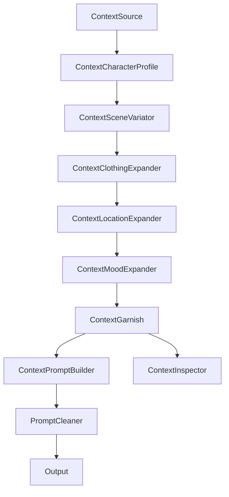
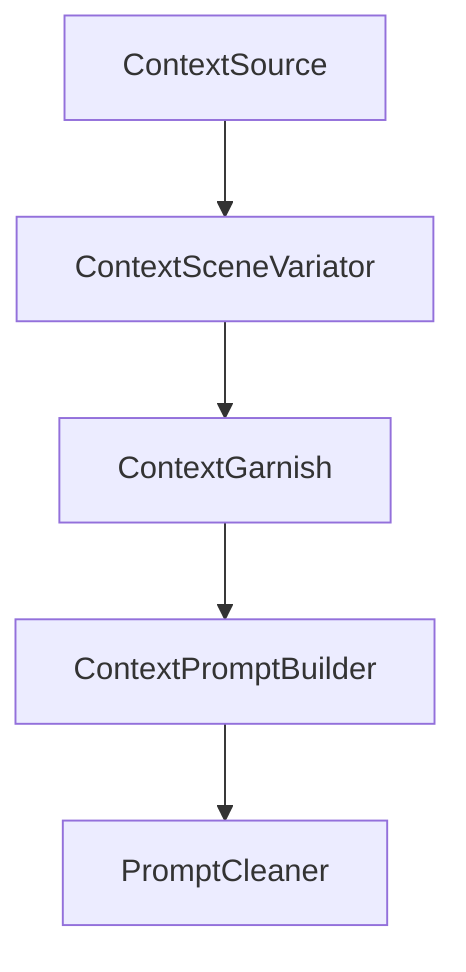

# Architecture & Data Flow

PromptBuilder は、ComfyUI 用の **構造化プロンプト生成システム** です。
現在の公開面は `context_json` を中心に扱う context-first アーキテクチャです。

## 概要

現在の設計上の特徴は次の通りです。

1. **Context-first transport**: ノード間の正式な受け渡しは
   `context_json: STRING` です。`PromptContext v2` を JSON 文字列として
   受け渡し、保存互換性を優先します。
2. **Shared logic first**: 生成ロジックは `pipeline/` に集約され、
   context-native ノードから利用されます。
3. **Shared business logic**: シーン変化、衣装展開、場所展開、ムード展開、
   ガーニッシュ、プロンプト組み立ては `pipeline/` に切り出されており、
   context-native ノードと検証スクリプトから再利用されます。
4. **Verification-first workflow**: スキーマ、codec、workflow sample、
   決定性の検証資産を `assets/` と `tools/` に揃えています。

---

## Directory Structure

```text
root/
├── core/
│   ├── schema.py              # PromptContext v2 dataclass と default 定義
│   ├── context_codec.py       # parse / normalize / serialize helpers
│   └── context_ops.py         # patch / merge / history / warning helpers
├── pipeline/
│   ├── source_pipeline.py     # source-loading shared logic
│   ├── context_pipeline.py    # scene / garnish shared logic
│   └── content_pipeline.py    # clothing / location / mood / prompt shared logic
├── docs/
│   └── context_refactor/      # summary + extension guidance + archived refactor record
├── verification/
│   ├── frontend/              # repo-local frontend schema / roundtrip tests
│   └── browser/               # repo-local Playwright GUI roundtrip tests
├── assets/
│   ├── ARCHITECTURE.md
│   ├── test_context_*.py
│   ├── test_workflow_samples.py
│   ├── verify_*.py
│   └── fixtures/
├── tools/
│   ├── verify_full_flow.py
│   ├── check_widgets_values.py
│   ├── analyze_context_workflow_diversity.py
│   ├── run_frontend_workflow_validation.ps1
│   └── run_custom_workflow_roundtrip.ps1
├── nodes_context.py           # context-native node family
├── nodes_*.py                 # public node entry points
├── ComfyUI-workflow-context.json
├── prompts.jsonl
└── mood_map.json
```

---

## Node Families

### Context-native nodes

- `ContextSource`
- `ContextCharacterProfile`
- `ContextSceneVariator`
- `ContextClothingExpander`
- `ContextLocationExpander`
- `ContextMoodExpander`
- `ContextGarnish`
- `ContextPromptBuilder`
- `ContextInspector`

これらが現在の推奨フローです。`context_json` を end-to-end でつなぎ、
必要な詳細は `extras` や `history` に蓄積します。

### Transition / bridge nodes

- 退役済み

### Legacy compatibility nodes

- 退役済み

---

## Data Flow

### Recommended context-first flow



### Mixed-mode migration flow

bridge support は退役済みです。以下は最終的に残った context-only flow です。



---

## Verification System

品質担保のため、以下のレイヤで検証します。

### Schema and codec

- `test_schema.py`
- `test_context_codec.py`
- `test_context_ops.py`

### Shared pipeline and node coverage

- `test_context_pipeline.py`
- `test_context_content_pipeline.py`
- `test_context_nodes.py`
- `test_personality_garnish.py`

### Workflow checks

- `test_workflow_samples.py`
- `tools/check_widgets_values.py`
- `tools/verify_full_flow.py`
- `assets/test_determinism.py`

### Legacy data and quality checks

- `test_composition.py`
- `test_consistency.py`
- `test_prompt_cleaner.py`
- `test_roulette_distribution.py`
- `test_vocab_lint.py`
- `verify_consistency.py`
- `verify_integrated_flow.py`
- `verify_location_quality.py`
- `verify_color_distribution.py`

### Evaluation and baselines

- `evaluate_kpi.py`
- `calc_variations.py`
- `generate_baseline.py`
- `generate_baseline_full.py`

---

## Principles

1. **Determinism**
   - 乱択は常に `seed` に基づいて再現可能であること。
   - `random.Random` や seed-mixing helper を通して段階ごとの差分を制御すること。

2. **Small stable schema**
   - transport-wide な概念だけを top-level に置き、可変な詳細は `extras` に寄せること。
   - 追加機能のために複数ノードへ新規 string socket を増やす前に、
     `context_json` に載せられないかを先に検討すること。

3. **Shared logic before wrappers**
   - 新しい生成ロジックはまず `pipeline/` に実装し、その後に
     context-native ノードや検証スクリプトへ接続すること。

4. **Robustness**
   - 空入力、破損 JSON、欠損データに対しても停止より forward progress を優先し、
     warning を残して継続できるようにすること。

---

## Transition Audit

Bridge ノードは退役済みです。移行用の配線例が必要な場合だけ
`docs/context_refactor/archive/` 配下の historical note を参照してください。

旧 workflow 修復用の一時ツールは `tools/archive/` と `assets/archive/` に退避し、
通常運用の入口には含めません。
